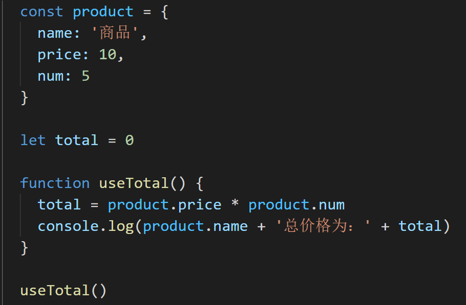

# 为什么需要编程规范？

**工欲善其事，必先利其器**

对于一些大型的企业级项目而言，通常情况下我们都是需要一个团队来进行开发的。而又因为团队人员对技术理解上的参差不齐，所以就会导致出现一种情况，那就是**一个项目无法具备统一的编程规范，导致项目的代码像多个不同材质的补丁拼接起来一样**

设想一下，下面的这段代码有一个团队进行开发，因为没有具备统一的代码标准，所以生成了下面的代码：

这段代码可以正常运行没有问题，但是整体的代码结构却非常的难看。

> 有的地方有空格进行分割，有的地方却没有
>
> 有的地方是单引号，有的地方却是双引号
>
> 有的地方有分号，有的地方没有分号
>

这样的项目虽然可以正常运行，但是如果把它放到大厂的项目中，确是 **不及格** 的，它会被认为是 **不可维护、不可扩展的代码内容**

那么所谓的大厂标准的代码结构应该是什么样子的呢？

我们把上面的代码进行一下修正，做一个对比：

修改之后的代码具备了统一的规范之后，是不是看起来就舒服多了！

并且以上所列举出来的只是《编程规范》中的一小部分内容！

那么有些同学可能就会说了，你列举出来这些编程规范有什么用啊！

哪怕你写上一部书，我们一个团队这么多人，总不能指望所有人都看一遍，并且严格的遵守你所说的规范吧！

说的没错！指望人主动的遵守这些规范不太现实

那怎么办呢？

那么我们可不可以另辟蹊径，让程序自动处理规范化的内容呢？

答案是：可以的！

这些也是我们本章节所需要讲解的重点内容！

本章节中我们会为大家讲解，如何自动化的对代码进行规范，其中主要包括：

1. 编码规范
2. git 规范

两大类

那么明确好了我们的范围之后，接下来就让我们创建一个项目，开始我们的代码规范之旅吧！