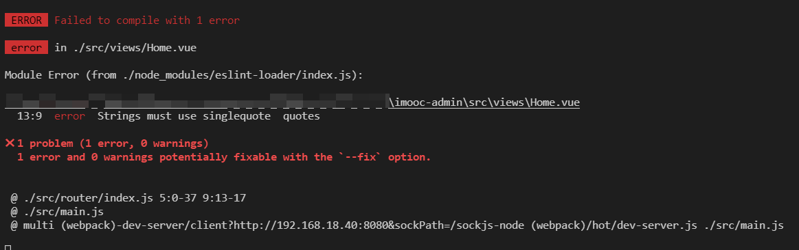

# 代码检测工具 ESLint 你了解多少？

对于 `ESLint` 的大名，同学们或多或少的应该都听说过，只不过有些同学可能了解的多一些，有些同学了解的少一些。

那么本小节我们就先来聊一下，这个赫赫有名的代码检测工具 `ESLint`

首先 `ESLint` 是 `2013年6月` 创建的一个开源项目，它的目标非常简单，只有一个，那就是 **提供一个插件化的 `javascript` 代码检测工具** ，说白了就是做 **代码格式检测使用的**

在咱们当前的项目中，包含一个 `.eslintrc.js` 文件，这个文件就是 `eslint` 的配置文件。

随着大家对代码格式的规范性越来越重视，`eslint` 也逐渐被更多的人所接收，同时也有很多大厂在原有的 `eslint` 规则基础之上进行了一些延伸。

我们在使用Vue-Cli创建项目时，就进行过这样的选择：

```js
? Pick a linter / formatter config:
  ESLint with error prevention only // 仅包含错误的 ESLint
  ESLint + Airbnb config // Airbnb 的 ESLint 延伸规则
  ESLint + Standard config // 标准的 ESLint 规则
```

打开项目中的 `.eslintrc.js` 文件

```js
// ESLint 配置文件遵循 commonJS 的导出规则，所导出的对象就是 ESLint 的配置对象
// 文档：https://eslint.bootcss.com/docs/user-guide/configuring
module.exports = {
  // 表示当前目录即为根目录，ESLint 规则将被限制到该目录下
  root: true,
  // env 表示启用 ESLint 检测的环境
  env: {
    // 在 node 环境下启动 ESLint 检测
    node: true
  },
  // ESLint 中基础配置需要继承的配置
  extends: ["plugin:vue/vue3-essential", "@vue/standard"],
  // 解析器
  parserOptions: {
    parser: "babel-eslint"
  },
  // 需要修改的启用规则及其各自的错误级别
  /**
   * 错误级别分为三种：
   * "off" 或 0 - 关闭规则
   * "warn" 或 1 - 开启规则，使用警告级别的错误：warn (不会导致程序退出)
   * "error" 或 2 - 开启规则，使用错误级别的错误：error (当被触发的时候，程序会退出)
   */
  rules: {
    "no-console": process.env.NODE_ENV === "production" ? "warn" : "off",
    "no-debugger": process.env.NODE_ENV === "production" ? "warn" : "off"
  }
};

```

那么到这里咱们已经大致的了解了`.eslintrc.js` 文件，基于 `ESLint` 如果我们出现不符合规范的代码格式时，那么就会得到一个对应的错误。

比如：


这个错误表示：

1. 此时我们触发了一个 **错误级别的错误**
2. 触发该错误的位置是 在 `Home.vue` 的第 13 行 第九列 中
3. 错误描述为：字符串必须使用单引号
4. 错误规则为：`quotes`

那么想要解决这个错误，通常情况下我们有两种方式：

1. 按照 `ESLint` 的要求修改代码
2. 修改 `ESLint` 的验证规则

**按照 `ESLint` 的要求修改代码：**

>  在 `Home.vue` 的第 13 行中把双引号改为单引号

**修改 `ESLint` 的验证规则：**

1. 在 `.eslintrc.js` 文件中，新增一条验证规则

   ```json
   "quotes": "error" // 默认
   "quotes": "warn" // 修改为警告
   "quotes": "off" // 修改不校验
   ```

那么这一小节，我们了解了 `vue-cli` 创建 `vue3` 项目时，`Standard config` 的 `ESLint` 配置，并且知道了如何解决 `ESLint` 报错的问题。

但是一个团队中，人员的水平高低不齐，大量的 `ESLint` 规则校验，会让很多的开发者头疼不已，从而大大影响了项目的开发进度。

试想一下，在你去完成项目代码的同时，还需要时时刻刻注意代码的格式问题，这将是一件多么痛苦的事情！

那么有没有什么办法，既可以保证 `ESLint` 规则校验，又可以解决严苛的格式规则导致的影响项目进度的问题呢？

欲知后事如何，请听下一节《`Prettier` ，让你的代码变得更漂亮！》