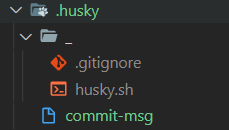

# 什么是 Git Hooks

上一小节中我们使用了 `git cz` 来代替了 `git commit` 实现了规范化的提交诉求，但是依然存在着有人会忘记使用的问题。

那么这一小节我们就来看一下这样的问题，我们应该如何去进行解决。

先来明确一下我们最终要实现的效果：

> 我们希望：
>
> 当《提交描述信息》不符合 [约定式提交规范](https://www.conventionalcommits.org/zh-hans/v1.0.0/) 的时候，阻止当前的提交，并抛出对应的错误提示

而要实现这个目的，我们就需要先来了解一个概念，叫做 `Git hooks（git 钩子 || git 回调方法）`

也就是：**`git` 在执行某个事件之前或之后进行一些其他额外的操作**

而我们所期望的 **阻止不合规的提交消息**，那么就需要使用到 `hooks` 的钩子函数。

下面是我整理出来的所有的 `hooks` ，大家可以进行一下参考，其中加粗的是常用到的 `hooks`：

| Git Hook      | 调用时机                                    | 说明                                               |
| :------------------------------ | -------------------------------------------------- | ------------------------------------------------------------ |
| pre-applypatch           | `git am`执行前                                               |                                                              |
| applypatch-msg        | `git am`执行前                                               |                                                              |
| post-applypatch       | `git am`执行后                                               | 不影响`git am`的结果                                         |
| **pre-commit**        | `git commit`执行前                                           | 可以用`git commit --no-verify`绕过                           |
| **commit-msg**        | `git commit`执行前                                           | 可以用`git commit --no-verify`绕过                           |
| post-commit           | `git commit`执行后                                           | 不影响`git commit`的结果                                     |
| pre-merge-commit      | `git merge`执行前                                            | 可以用`git merge --no-verify`绕过。                          |
| prepare-commit-msg    | `git commit`执行后，编辑器打开之前                           |                                                              |
| pre-rebase            | `git rebase`执行前                                           ||
| post-checkout   | `git checkout`或`git switch`执行后                           | 如果不使用`--no-checkout`参数，则在`git clone`之后也会执行。 |
| post-merge            | `git commit`执行后                                           | 在执行`git pull`时也会被调用                                 |
| pre-push              | `git push`执行前                                             |                                                              |
| pre-receive           | `git-receive-pack`执行前                                     |                                                              |
| update                |                                                              |                                                              |
| post-receive          | `git-receive-pack`执行后                                     | 不影响`git-receive-pack`的结果                               |
| post-update           | 当 `git-receive-pack`对 `git push` 作出反应并更新仓库中的引用时 |                                                              |
| push-to-checkout      | 当``git-receive-pack`对`git push`做出反应并更新仓库中的引用时，以及当推送试图更新当前被签出的分支且`receive.denyCurrentBranch`配置被设置为`updateInstead`时 |                                                              |
| pre-auto-gc           | `git gc --auto`执行前                                        |                                                              |
| post-rewrite          | 执行`git commit --amend`或`git rebase`时                     |                                                              |
| sendemail-validate    | `git send-email`执行前                                       |                                                              |
| fsmonitor-watchman    | 配置`core.fsmonitor`被设置为`.git/hooks/fsmonitor-watchman`或`.git/hooks/fsmonitor-watchmanv2`时 |                                                              |
| p4-pre-submit         | `git-p4 submit`执行前                                        | 可以用`git-p4 submit --no-verify`绕过                        |
| p4-prepare-changelist | `git-p4 submit`执行后，编辑器启动前                          | 可以用`git-p4 submit --no-verify`绕过                        |
| p4-changelist         | `git-p4 submit`执行并编辑完`changelist message`后            | 可以用`git-p4 submit --no-verify`绕过                        |
| p4-post-changelist    | `git-p4 submit`执行后                                        |                                                              |
| post-index-change     | 索引被写入到`read-cache.c do_write_locked_index`后           |                                                              |

PS：详细的 `HOOKS介绍` 可点击[这里](https://git-scm.com/docs/githooks)查看

整体的 `hooks` 非常多，当时我们其中用的比较多的其实只有两个：

| Git Hook       | 调用时机                                                     | 说明                               |
| :------------- | ------------------------------------------------------------ | ---------------------------------- |
| **pre-commit** | `git commit`执行前<br />它不接受任何参数，并且在获取提交日志消息并进行提交之前被调用。脚本`git commit`以非零状态退出会导致命令在创建提交之前中止。 | 可以用`git commit --no-verify`绕过 |
| **commit-msg** | `git commit`执行前<br />可用于将消息规范化为某种项目标准格式。<br />还可用于在检查消息文件后拒绝提交。 | 可以用`git commit --no-verify`绕过 |

简单来说这两个钩子：

1. `commit-msg`：可以用来规范化标准格式，并且可以按需指定是否要拒绝本次提交
2. `pre-commit`：会在提交前被调用，并且可以按需指定是否要拒绝本次提交

而我们接下来要做的关键，就在这两个钩子上面。

## 使用 husky + commitlint 检查提交描述是否符合规范要求

在上一小节中，我们了解了 `git hooks` 的概念，那么接下来我们就使用 `git hooks` 来去校验我们的提交信息。

要完成这么个目标，那么我们需要使用两个工具：

1. [commitlint](https://github.com/conventional-changelog/commitlint)：用于检查提交信息

2. [husky](https://github.com/typicode/husky)：是`git hooks`工具

注意：**`npm` 需要在 7.x 以上版本！！！！！**

那么下面我们分别来去安装一下这两个工具：

### commitlint

1. 安装依赖：

   ```sh
   npm install --save-dev @commitlint/config-conventional@12.1.4 @commitlint/cli@12.1.4
   ```

2. 创建 `commitlint.config.js` 文件

   ```sh
   echo "module.exports = {extends: ['@commitlint/config-conventional']}" > commitlint.config.js
   ```

3. 打开 `commitlint.config.js` ， 增加配置项（ [config-conventional 默认配置点击可查看](https://github.com/conventional-changelog/commitlint/blob/master/@commitlint/config-conventional/index.js) ）：

   ```js
   module.exports = {
     // 继承的规则
     extends: ['@commitlint/config-conventional'],
     // 定义规则类型
     rules: {
       // type 类型定义，表示 git 提交的 type 必须在以下类型范围内
       'type-enum': [
         2,
         'always',
         [
           'feat', // 新功能 feature
           'fix', // 修复 bug
           'docs', // 文档注释
           'style', // 代码格式(不影响代码运行的变动)
           'refactor', // 重构(既不增加新功能，也不是修复bug)
           'perf', // 性能优化
           'test', // 增加测试
           'chore', // 构建过程或辅助工具的变动
           'revert', // 回退
           'build' // 打包
         ]
       ],
       // subject 大小写不做校验
       'subject-case': [0]
     }
   }

   ```

**注意：确保保存为 `UTF-8` 的编码格式**，否则可能会出现以下错误：


接下来我们来安装 `husky`

### husky

1. 安装依赖：

   ```sh
   npm install husky@7.0.1 --save-dev
   ```

2. 启动 `hooks` ， 生成 `.husky` 文件夹

   ```sh
   npx husky install
   ```

   

3. 在 `package.json` 中生成 `prepare` 指令（ **需要 npm > 7.0 版本** ）

   ```sh
   npm set-script prepare "husky install"
   ```

   

4. 执行 `prepare` 指令屏

   ```sh
   npm run prepare
   ```

5. 执行成功，提示

   

6. 添加 `commitlint` 的 `hook` 到 `husky`中，并指令在 `commit-msg` 的 `hooks` 下执行 `npx --no-install commitlint --edit "$1"` 指令

   ```sh
   npx husky add .husky/commit-msg 'npx --no-install commitlint --edit "$1"'
   ```

7. 此时的 `.husky` 的文件结构
   

至此， 不符合规范的 commit 将不再可提交：

```sh
PS F:\xxxxxxxxxxxxxxxxxxxxx\imooc-admin> git commit -m "测试"
⧗   input: 测试
✖   subject may not be empty [subject-empty]
✖   type may not be empty [type-empty]

✖   found 2 problems, 0 warnings
ⓘ   Get help: https://github.com/conventional-changelog/commitlint/#what-is-commitlint

husky - commit-msg hook exited with code 1 (error)
```

那么至此，我们就已经可以处理好了 **强制规范化的提交要求**，到现在 **不符合规范的提交信息，将不可在被提交！**

那么到这里我们的 **规范化目标** 就完成了吗？

当然没有！

现在我们还缺少一个 **规范化的处理** ，那就是 **代码格式提交规范处理！**

有同学看到这里可能说，咦！ 这个怎么看着这么眼熟啊？这个事情我们之前不是做过了吗？还需要在处理什么？

## 通过 pre-commit 检测提交时代码规范

在 **`ESLint` 与 `Prettier` 配合解决代码格式问题** 的章节中，我们讲解了如何处理 **本地！代码格式问题。**

但是这样的一个格式处理问题，他只能够在本地进行处理，并且我们还需要 **手动在  `VSCode` 中配置自动保存** 才可以。那么这样就会存在一个问题，要是有人忘记配置这个东西了怎么办呢？他把代码写的乱七八糟的直接就提交了怎么办呢？

所以我们就需要有一种方式来规避这种风险。

那么想要完成这么一个操作就需要使用 `husky` 配合 `eslint` 才可以实现。

我们期望通过 **`husky` 监测 `pre-commit` 钩子，在该钩子下执行 `npx eslint --ext .js,.vue src`** 指令来去进行相关检测：

1. 执行 `npx husky add .husky/pre-commit "npx eslint --ext .js,.vue src"` 添加 `commit` 时的 `hook` （`npx eslint --ext .js,.vue src` 会在执行到该 hook 时运行）

2. 该操作会生成对应文件 `pre-commit`：
   

3. 关闭 `VSCode` 的自动保存操作

4. 修改一处代码，使其不符合 `ESLint` 校验规则

5. 执行 **提交操作** 会发现，抛出一系列的错误，代码无法提交

   ```sh
   PS F:\xxxxxxxxxxxxxxxxxxx\imooc-admin> git commit -m 'test'

   F:\xxxxxxxxxxxxxxxx\imooc-admin\src\views\Home.vue
     13:9  error  Strings must use singlequote  quotes

   ✖ 1 problem (1 error, 0 warnings)
     1 error and 0 warnings potentially fixable with the `--fix` option.

   husky - pre-commit hook exited with code 1 (error)
   ```

6. 想要提交代码，必须处理完成所有的错误信息

那么到这里位置，我们已经通过 `pre-commit` 检测到了代码的提交规范问题。

那么到这里就万事大吉了吗？

在这个世界上从来不缺的就是懒人，错误的代码格式可能会抛出很多的 `ESLint` 错误，让人看得头皮发麻。严重影响程序猿的幸福指数。

那么有没有办法，让程序猿在 0 配置的前提下，哪怕代码格式再乱，也可以 **”自动“** 帮助他修复对应的问题，并且完成提交呢？

你别说，还真有！

## lint-staged 自动修复格式错误

在上一章中我们通过 `pre-commit` 处理了 **检测代码的提交规范问题，当我们进行代码提交时，会检测所有的代码格式规范** 。

但是这样会存在两个问题：

1. 我们只修改了个别的文件，没有必要检测所有的文件代码格式
2. 它只能给我们提示出对应的错误，我们还需要手动的进行代码修改

那么这一小节，我们就需要处理这两个问题

那么想要处理这两个问题，就需要使用另外一个插件 [lint-staged](https://github.com/okonet/lint-staged) ！

[lint-staged](https://github.com/okonet/lint-staged) 可以让你当前的代码检查 **只检查本次修改更新的代码，并在出现错误的时候，自动修复并且推送**

[lint-staged](https://github.com/okonet/lint-staged) 无需单独安装，我们生成项目时，`vue-cli` 已经帮助我们安装过了，所以我们直接使用就可以了

1. 修改 `package.json` 配置

   ```js
   "lint-staged": {
       "src/**/*.{js,vue}": [
         "eslint --fix",
         "git add"
       ]
     }
   ```

2. 如上配置，每次它只会在你本地 `commit` 之前，校验你提交的内容是否符合你本地配置的 `eslint`规则(这个见文档 [ESLint](https://panjiachen.github.io/vue-element-admin-site/zh/guide/advanced/eslint.html) )，校验会出现两种结果：

   1. 如果符合规则：则会提交成功。
   2. 如果不符合规则：它会自动执行 `eslint --fix` 尝试帮你自动修复，如果修复成功则会帮你把修复好的代码提交，如果失败，则会提示你错误，让你修好这个错误之后才能允许你提交代码。

3. 修改 `.husky/pre-commit` 文件

   ```js
   #!/bin/sh
   . "$(dirname "$0")/_/husky.sh"

   npx lint-staged

   ```

4. 再次执行提交代码

5. 发现 **暂存区中** 不符合 `ESlint` 的内容，被自动修复
