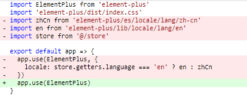
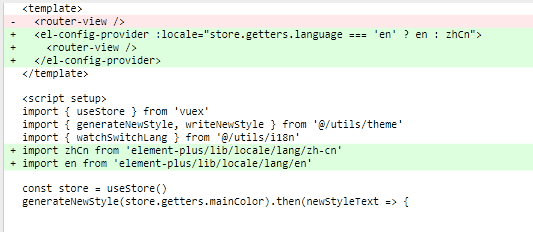

# 国际化实现原理

先来看一个需求：

> 我们有一个变量 `msg` ，但是这个 `msg` 有且只能有两个值：
>
> 1. hello world
> 2. 你好世界
>
> 要求：根据需要切换 `msg` 的值

这样的一个需求就是 国际化 的需求，那么我们可以通过以下代码来实现这个需求

```js
<script>
  // 1. 定义 msg 值的数据源
  const messages = {
    en: {
      msg: 'hello world'
    },
    zh: {
      msg: '你好世界'
    }
  }
  // 2. 定义切换变量
  let locale = 'en'
  // 3. 定义赋值函数
  function t(key) {
    return messages[locale][key]
  }
  // 4. 为 msg 赋值
  let msg = t('msg')
  console.log(msg);
  // 修改 locale， 重新执行 t 方法，获取不同语言环境下的值

</script>
```

 总结：

1. 通过一个变量来 **控制** 语言环境
2. 所有语言环境下的数据源要 **预先** 定义好
3. 通过一个方法来获取 **当前语言** 下 **指定属性** 的值
4. 该值即为国际化下展示值

## 基于 vue-i18n V9  的国际化实现方案分析

在 `vue` 的项目中，我们不需要手写这么复杂的一些基础代码，可以直接使用 [vue-i18n](https://vue-i18n.intlify.dev/) 进行实现（注意：**`vue3` 下需要使用 `V 9.x` 的 `i18n`**）

[vue-i18n](https://vue-i18n.intlify.dev/guide/) 的使用可以分为四个部分：

1. 创建 `messages` 数据源
2. 创建 `locale` 语言变量
3. 初始化 `i18n` 实例
4. 注册 `i18n` 实例

那么接下来我们就去实现以下：

1. 安装 `vue-i18n`

   ```sh
   npm install vue-i18n@next
   ```

2. 创建 `i18n/index.js` 文件

3. 创建 `messages` 数据源

   ```js
   const messages = {
     en: {
       msg: {
         test: 'hello world'
       }
     },
     zh: {
       msg: {
         test: '你好世界'
       }
     }
   }
   ```

4. 创建 `locale` 语言变量

   ```js
   const locale = 'en'
   ```

5. 初始化 `i18n` 实例

   ```js
   import { createI18n } from 'vue-i18n'

   const i18n = createI18n({
     // 使用 Composition API 模式，则需要将其设置为false
     legacy: false,
     // 全局注入 $t 函数
     globalInjection: true,
     locale,
     messages
   })
   ```

6. 把 `i18n` 注册到 `vue` 实例

   ```js
   export default i18n
   ```

7. 在 `main.js` 中导入

   ```js
   // i18n （PS：导入放到 APP.vue 导入之前，因为后面我们会在 app.vue 中使用国际化内容）
   import i18n from '@/i18n'
   ...
   app.use(i18n)
   ```

8. 在 `layout/components/Sidebar/index.vue` 中使用 `i18n`

   ```html
   <h1 class="logo-title" v-if="$store.getters.sidebarOpened">
      {{ $t('msg.test') }}
   </h1>
   ```

9. 修改 `locale` 的值，即可改变展示的内容

截止到现在我们已经实现了 `i18n` 的最基础用法，那么解下来我们就可以在项目中使用 `i18n` 完成国际化。

项目中完成国际化分成以下几步进行:

1. 封装 `langSelect` 组件用于修改 `locale`
2. 导入 `el-locale` 语言包
3. 创建自定义语言包

## 封装  langSelect  组件

1. 定义 `store/app.js`

   ```js
   import { LANG } from '@/constant'
   import { getItem, setItem } from '@/utils/storage'
   export default {
     namespaced: true,
     state: () => ({
       ...
       language: getItem(LANG) || 'zh'
     }),
     mutations: {
       ...
       /**
        * 设置国际化
        */
       setLanguage(state, lang) {
         setItem(LANG, lang)
         state.language = lang
       }
     },
     actions: {}
   }

   ```

2. 在 `constant` 中定义常量

   ```js
   // 国际化
   export const LANG = 'language'
   ```

3. 创建 `components/LangSelect/index`

   ```vue
   <template>
     <el-dropdown
       trigger="click"
       class="international"
       @command="handleSetLanguage"
     >
       <div>
         <el-tooltip content="国际化" :effect="effect">
           <svg-icon icon="language" />
         </el-tooltip>
       </div>
       <template #dropdown>
         <el-dropdown-menu>
           <el-dropdown-item :disabled="language === 'zh'" command="zh">
             中文
           </el-dropdown-item>
           <el-dropdown-item :disabled="language === 'en'" command="en">
             English
           </el-dropdown-item>
         </el-dropdown-menu>
       </template>
     </el-dropdown>
   </template>

   <script setup>
   import { useI18n } from 'vue-i18n'
   import { defineProps, computed } from 'vue'
   import { useStore } from 'vuex'
   import { ElMessage } from 'element-plus'

   defineProps({
     effect: {
       type: String,
       default: 'dark',
       validator: function(value) {
         // 这个值必须匹配下列字符串中的一个
         return ['dark', 'light'].indexOf(value) !== -1
       }
     }
   })

   const store = useStore()
   const language = computed(() => store.getters.language)

   // 切换语言的方法
   const i18n = useI18n()
   const handleSetLanguage = lang => {
     i18n.locale.value = lang
     store.commit('app/setLanguage', lang)
     ElMessage.success('更新成功')
   }
   </script>
   ```

4. 在 `navbar` 中导入 `LangSelect`

   ```vue
   <template>
     <div class="navbar">
       ...
       <div class="right-menu">
         <lang-select class="right-menu-item hover-effect" />
         <!-- 头像 -->
         ...
       </div>
     </div>
   </template>

   <script setup>
   import LangSelect from '@/components/LangSelect'
   ...
   </script>

   <style lang="scss" scoped>
   .navbar {
     ...

     .right-menu {
       ...

       ::v-deep .right-menu-item {
         display: inline-block;
         padding: 0 18px 0 0;
         font-size: 24px;
         color: #5a5e66;
         vertical-align: text-bottom;

         &.hover-effect {
           cursor: pointer;
         }
       }

       ...
   }
   </style>

   ```

## element-plus 国际化处理

截止到目前，我们的国际化内容已经基本功能已经处理完成了。接下来需要处理的就是对应的语言包，有了语言包就可以实现整个项目中的所有国际化处理了。

那么对于语言包来说，我们整个项目中会分成两部分：

1. `element-plus` 语言包：用来处理 `element` 组件的国际化功能
2. 自定义语言包：用来处理 **非**`element` 组件的国际化功能

那么首先我们先来处理 `element-plus` 语言包：

**按照正常的逻辑，我们是可以通过 `element-ui` 配合 `vue-i18n`来实现国际化功能的，但是目前的 `element-plus` 尚未提供配合  `vue-i18n` 实现国际化的方式！**

所以说，我们暂时只能先去做临时处理，等到 `element-plus` 支持 `vue-i18n` 功能之后，我们再进行对接实现

那么临时处理我们怎么去做呢？

1. 升级 `element-plus` 到最新版本

   ```sh
   npm i element-plus
   ```

2. 在 `plugins/index` 中导入 `element` 的中文、英文语言包：

   ```js
   import zhCn from 'element-plus/es/locale/lang/zh-cn'
   import en from 'element-plus/lib/locale/lang/en'
   ```

3. 注册 `element` 时，根据当前语言选择使用哪种语言包

   ```js
   import store from '@/store'

   export default app => {
     app.use(ElementPlus, {
       locale: store.getters.language === 'en' ? en : zhCn
     })
   }
   ```

## 自定义语言包国际化处理

处理完 `element` 的国际化内容之后，接下来我们来处理 **自定义语言包**。

自定义语言包我们使用了 `commonJS` 导出了一个对象，这个对象就是所有的 **自定义语言对象**

1. 在 `lang/index` 中，导入语言包

   ```js
   import mZhLocale from './lang/zh'
   import mEnLocale from './lang/en'
   ```

2. 在 `messages` 中注册到语言包

   ```js
   const messages = {
     en: {
       msg: {
         ...mEnLocale
       }
     },
     zh: {
       msg: {
         ...mZhLocale
       }
     }
   }
   ```

## 国际化缓存处理

我们希望在 **刷新页面后，当前的国际化选择可以被保留**，所以想要实现这个功能，那么就需要进行 **国际化的缓存处理**

此处的缓存，我们依然通过两个方面进行：

1. `vuex` 缓存
2. `LocalStorage` 缓存

只不过这里的缓存，我们已经在处理 **`langSelect` 组件时** 处理完成了，所以此时我们只需要使用缓存下来的数据即可。

在 `i18n/index` 中，创建 `getLanguage` 方法：

```js
import store from '@/store'
/**
 * 返回当前 lang
 */
function getLanguage() {
  return store && store.getters && store.getters.language
}
```

修改 `createI18n` 的 `locale` 为 `getLanguage()`

```js
const i18n = createI18n({
  ...
  locale: getLanguage()
})
```

## 更新：关于 element-plus 国际化问题更新

现在 `element-plus` 已经提供了 [国际化的处理方案](https://element-plus.org/zh-CN/guide/i18n.html#configprovider)，我们可以直接通过 `el-config-provider` 组件中的 `locale` 属性来指定当前国际化环境。

具体代码如下：

1. 在 `src/plugins/element` 中
   
2. 在 `src/App.vue` 中
   

## 国际化方案总结

国际化是前端项目中的一个非常常见的功能，那么在前端项目中实现国际化主要依靠的就是 `vue-i18n` 这个第三方的包。

关于国际化的实现原理大家可以参照 **国际化实现原理** 这一小节，这里我们就不再赘述了。

而  `i18n` 的使用，整体来说就分为这么四步：

1. 创建 `messages` 数据源
2. 创建 `locale` 语言变量
3. 初始化 `i18n` 实例
4. 注册 `i18n` 实例

核心的内容其实就是 数据源的部分，但是大家需要注意，如果你的项目中使用了 **第三方组件库** ，那么不要忘记 **第三方组件库的数据源** 需要 **单独** 进行处理！
