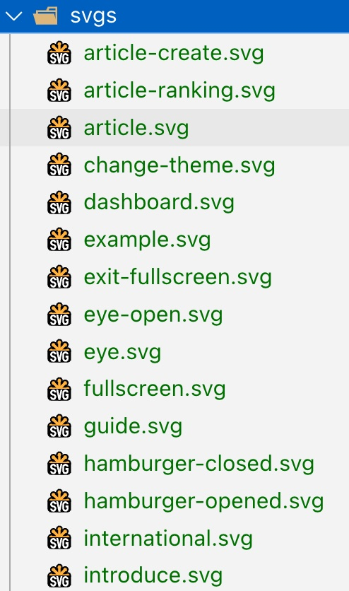
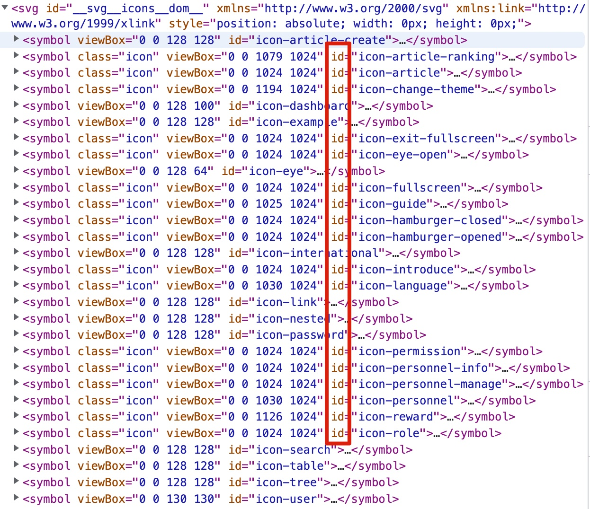

# Icon 图标处理方案：SvgIcon

在我们的日常开发中,对于项目中所使用的`icon`图标,一共分为两类:

1. `element-plus`的图标
2. 自定义的`svg`图标

对于 `element-plus` 的图标我们可以直接通过 `el-icon` 来进行显示，但是自定义图标的话，我们暂时还缺少显示的方式，所以说我们需要一个自定义的组件，来显示我们自定义的 `svg` 图标。

那么对于这个组件的话，它应该拥有两种能力：

1. 显示外部 `svg` 图标
2. 显示项目内的 `svg` 图标

基于以上概念，我们可以创建出以下对应代码：

创建 `components/SvgIcon/index.vue`：

```vue{12,36-37,42}
<template>
  <!-- 外部图标 -->
  <div
    v-if="isExternal"
    :style="externalIconStyle"
    :class="className"
    class="svg-external-icon svg-icon"
  ></div>

  <!-- 内部图标 -->
  <svg v-else :class="className" class="svg-icon">
    <use :xlink:href="symbolId" />
  </svg>
</template>
<script setup lang="ts">
  import { computed } from 'vue'

  interface Props {
    icon: string // 外部资源或内部图标
    className?: string
  }
  const props = withDefaults(defineProps<Props>(), {
    icon: '',
    className: '',
  })

  const external = (path: string) => {
    return /^(https?:|mailto:|tel:)/.test(path)
  }
  // 判断是否为外部资源
  const isExternal = computed(() => external(props.icon))

  // 外部图标样式
  const externalIconStyle = computed(() => {
    return {
      mask: `url(${props.icon}) no-repeat 50% 50%`,
      '-webkit-mask': `url(${props.icon}) no-repeat 50% 50%`,
    }
  })

  // 内部图标use 引用的dom id
  const symbolId = computed(() => `#icon-${props.icon}`)
</script>
<style lang="scss" scoped>
  .svg-icon {
    width: 1em;
    height: 1em;
    vertical-align: -0.15em;
    fill: currentColor;
    overflow: hidden;
  }

  .svg-external-icon {
    background-color: currentColor;
    mask-size: cover !important;
    -webkit-mask-size: cover !important;
    display: inline-block;
  }
</style>
```

然后全局注册该组件

```ts{4}
import SvgIcon from '@/components/SvgIcon/index.vue'

const app = createApp(App).use(ElementPlus).use(router).use(store)
app.component('svg-icon', SvgIcon)
app.mount('#app')
```

## 外部图标

对于外部图标,直接传入url即可

```html
<span class="svg-container">
  <svg-icon icon="https://res.lgdsunday.club/user.svg"></svg-icon>
</span>
```

## 内部图标

一般是将所有svg图标放到一个统一的目录下


然后通过插件生成svg雪碧图挂载到body末尾



每个`<Symbol>`元素的id和目录中svg的文件名绑定

因为在`<SvgIcon>`内部, 我们是通过`#icon-`拼接`props.icon`

```ts
const symbolId = computed(() => `#icon-${props.icon}`)
```

所以,在使用`<SvgIcon>`组件时,只需将`icon`属性设置为相应的svg文件名即可

```html
<svg-icon icon="password"></svg-icon>
```

## 插件

+ vite插件: [vite-plugin-svg-icons](https://www.npmjs.com/package/vite-plugin-svg-icons)
  + vite.config.js

  ```js{6-11}
  plugins: [
    vue(),
    vueJsx({
      // options are passed on to @vue/babel-plugin-jsx
    }),
    createSvgIconsPlugin({
      // 指定需要缓存的图标文件夹
      iconDirs: [resolve(process.cwd(), 'src/assets/svgs')],
      // 指定symbolId格式
      symbolId: 'icon-[dir]-[name]',
    }),
  ],
  ```

  + main.ts

  ```ts
  import 'virtual:svg-icons-register'
  ```

+ webpack插件: [svg-sprite-loader](https://www.npmjs.com/package/svg-sprite-loader)