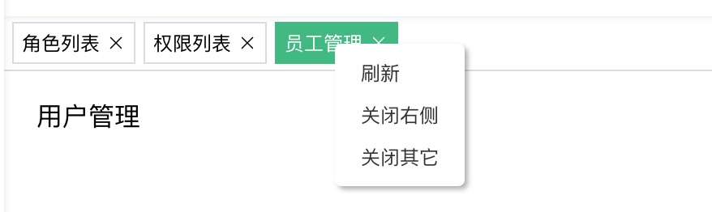

# TagViews 方案解析

## 什么是TagViews


所谓 `tagsView` 可以分成两部分来去看：

1. tags
2. view

好像和废话一样是吧。那怎么分开看呢？

首先我们先来看 `tags`：

所谓 `tgas` 指的是：**位于 `appmain` 之上的标签**

那么现在我们忽略掉 `view`，现在只有一个要求：

> 在 `view` 之上渲染这个 `tag`

仅看这一个要求，很简单吧。

**views：**

明确好了 `tags` 之后，我们来看 `views`。

脱离了 `tags` 只看 `views` 就更简单了，所谓 `views` ：**指的就是一个用来渲染组件的位置**，就像我们之前的 `Appmain` 一样，只不过这里的 `views` 可能稍微复杂一点，因为它需要在渲染的基础上增加：

1. 动画
2. 缓存

这两个额外的功能。

加上这两个功能之后可能会略显复杂，但是 [官网已经帮助我们处理了这个问题](https://next.router.vuejs.org/zh/guide/advanced/transitions.html#%E5%9F%BA%E4%BA%8E%E8%B7%AF%E7%94%B1%E7%9A%84%E5%8A%A8%E6%80%81%E8%BF%87%E6%B8%A1)

所以 单看 `views` 也是一个很简单的功能。

那么接下来我们需要做的就是把 `tags` 和 `view` 合并起来而已。

那么明确好了原理之后，我们就来看 **实现方案：**

1. 创建 `tagsView` 组件：用来处理 `tags` 的展示
2. 处理基于路由的动态过渡，在 `AppMain` 中进行：用于处理 `view` 的部分

整个的方案就是这么两大部，但是其中我们还需要处理一些细节相关的，**完整的方案为**：

1. 监听路由变化，组成用于渲染 `tags` 的数据源
2. 创建 `tags` 组件，根据数据源渲染 `tag`，渲染出来的 `tags` 需要同时具备
   1. 国际化 `title`
   2. 路由跳转
   3. 处理鼠标右键效果，根据右键处理对应数据源
3. 处理基于路由的动态过渡

那么明确好了方案之后，接下来我们根据方案进行处理即可。

## 监听路由变化,获取`tags`数据源

```ts
  // AppMain.vue
  watch(
    route,
    (to) => {
      // 并不是所有的路由都需要保存
      if (ROUTE_WHITE_LIST.indexOf(to.path) === -1) {
        appStore.setTagsView({ ...to, title: getTitle(to) })
      }
    },
    { immediate: true },
  )

  const getTitle = (routeItem: RouteLocationNormalizedLoaded) => {
    let title = ''
    if (routeItem.meta) {
      // generateTitle是封装的国际化操作
      title = generateTitle(routeItem.meta.title as string)
    } else {
      const pathArr = routeItem.path.split('/')
      title = pathArr[pathArr.length - 1]
    }
    return title
  }

  // Pinia
  setTagsView(tagView: TagView) {
    const exist = this.tagViews.find((item) => item.path === tagView.path)
    if (!exist) {
      this.tagViews.push(tagView)
      setItem(TAGS_VIEW, this.tagViews)
    }
  },
```

## 创建Tags组件

```vue
<template>
  <div class="tags-view-container">
    <div
      v-for="(tag, idx) in tagViews"
      :key="tag.path"
      class="tag-item"
      :class="{ active: isActiveTag(tag.path) }"
      @click="go(tag.path)"
      @contextmenu.prevent="(e: MouseEvent) => openContextMenu(e, idx)"
    >
      {{ tag.title }}
      <el-icon class="close-icon" @click.stop="removeTag(idx, tag)"><Close /></el-icon>
    </div>
    <div class="context-menu" :style="contextMenuStyle" v-if="contextMenuShow">
      <span @click="refresh">刷新</span>
      <span @click="closeRight">关闭右侧</span>
      <span @click="closeOther">关闭其它</span>
    </div>
  </div>
</template>
<script setup lang="ts">
  import { Close } from '@element-plus/icons-vue'
  import { computed, ref, unref, watch } from 'vue'
  import { useRoute, useRouter } from 'vue-router'
  import { useAppStore } from '@/store'
  import { TagView } from '#/sys'

  const appStore = useAppStore()
  const route = useRoute()
  const router = useRouter()
  const tagViews = computed(() => appStore.tagViews)
  const isActiveTag = (path: string) => path === route.path

  const afterRemoveTag = () => {
    if (tagViews.value.length) {
      router.push(tagViews.value[tagViews.value.length - 1].path)
    } else {
      router.push('/')
    }
  }
  const removeTag = (idx: number, tag: TagView) => {
    appStore.removeTagView(idx)
    if (tag.path === route.path) {
      afterRemoveTag()
    }
  }

  const go = (path: string) => {
    router.push(path)
  }

  /**
   * 右键相关
   */
  const contextMenuStyle = ref({ left: '0px' })
  const contextMenuShow = ref(false)
  const currentClickTag = ref(0)
  const openContextMenu = (e: MouseEvent, index: number) => {
    contextMenuShow.value = true
    currentClickTag.value = index
    const div = e.target as HTMLDivElement
    const offsetLeft = div.offsetLeft || 0
    const clientWidth = div.clientWidth || 0
    contextMenuStyle.value = {
      left: `${offsetLeft + clientWidth / 2}px`,
    }
  }
  const reset = () => {
    currentClickTag.value = 0
    contextMenuShow.value = false
  }
  const refresh = () => {
    router.go(0)
    reset()
  }
  const closeOther = () => {
    appStore.removeTagView(unref(currentClickTag), 'other')
    reset()
    afterRemoveTag()
  }
  const closeRight = () => {
    appStore.removeTagView(unref(currentClickTag), 'right')
    reset()
    afterRemoveTag()
  }

  watch(contextMenuShow, (val) => {
    if (val) {
      document.body.addEventListener('click', reset)
    } else {
      document.body.removeEventListener('click', reset)
    }
  })
</script>
<style lang="scss" scoped>
  .tags-view-container {
    display: flex;
    align-items: center;
    height: $tagViewsHeight;
    box-sizing: border-box;
    border-bottom: 1px solid #d8dce5;
    position: relative;
    .tag-item {
      height: 26px;
      font-size: 12px;
      border: 1px solid #d8dce5;
      box-sizing: border-box;
      display: flex;
      justify-content: center;
      align-items: center;
      padding: 0 5px;
      margin-left: 5px;
      cursor: pointer;
      .close-icon {
        margin-left: 4px;
        &:hover {
          background-color: #d8dce5;
          border-radius: 50%;
        }
      }
    }
    .context-menu {
      margin: 0;
      background: #fff;
      z-index: 3000;
      position: absolute;
      list-style-type: none;
      padding: 5px 0;
      border-radius: 4px;
      font-size: 12px;
      font-weight: 400;
      color: #333;
      box-shadow: 2px 2px 3px 0 rgb(0 0 0 / 30%);
      display: flex;
      flex-direction: column;
      top: 17px;
      span {
        margin: 0;
        padding: 7px 16px;
        cursor: pointer;
        &:hover {
          background: #eee;
        }
      }
    }
    .active {
      background-color: #42b983;
      color: #fff;
      border-color: #42b983;
    }
  }
</style>
```

## 处理AppMain.vue的动画过度效果

```vue
<template>
  <div class="app-main">
    <router-view v-slot="{ Component, route }">
      <transition name="fade" mode="out-in">
        <keep-alive>
          <component :is="Component" :key="route.path"></component>
        </keep-alive>
      </transition>
    </router-view>
  </div>
</template>

```
